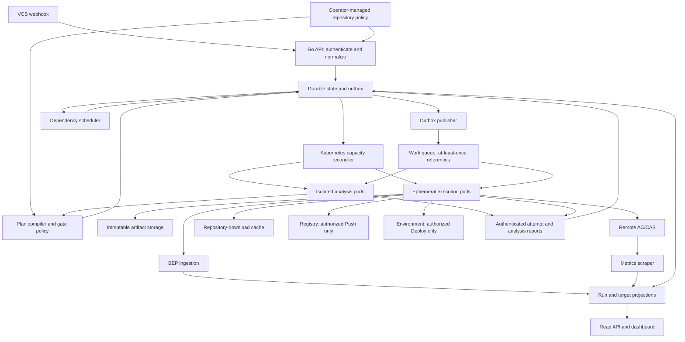
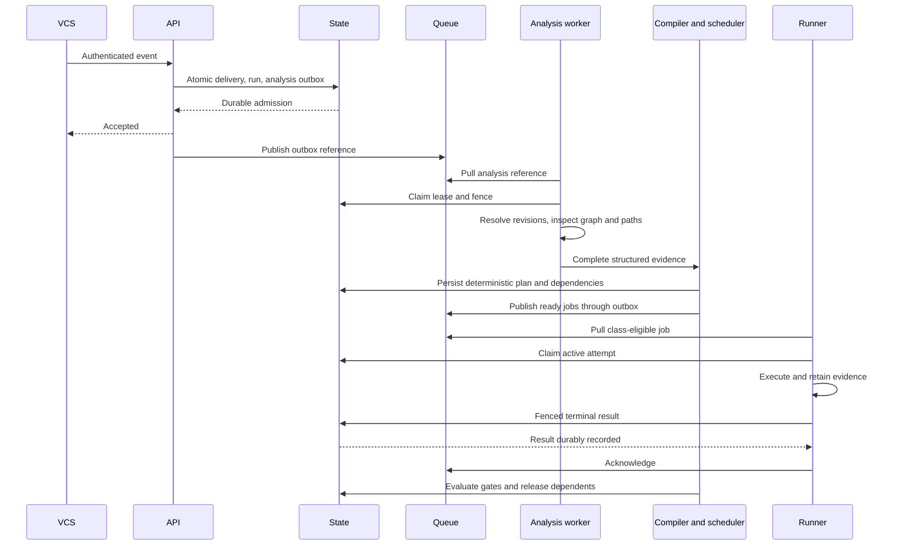
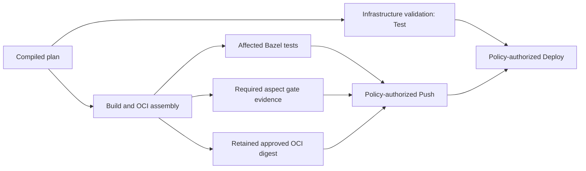

# Keystone delivery plan

**Status:** Proposed delivery plan. All product work items are planned; this document does not claim an implemented CI platform.

## 1. Goal and scope

Keystone is delta-aware CI orchestration for Bazel monorepos. The goal is to reduce unnecessary build, test and image-assembly work while retaining dependable quality gates and infrastructure workflows. Delivery follows five sprints: Go control plane and Kubernetes lifecycle; daemonless runners and OCI; hybrid change selection; caching; and BEP telemetry, aspects and dashboarding.

Delta-aware selection means affected targets and their necessary dependencies under a declared configuration. A downstream target can be affected without its own source file changing. Selection failure must not be represented as a successful empty plan.

### Current repository baseline

At baseline commit `c8356a9d4a94aacd7c7360e11a83ca76681e75dc`, the tracked repository contains a README and development guidance under `.agents/`, `.github/agents/` and `docs/ai-harness/`. There is no Go module, Bazel workspace/module, BUILD configuration, application code, Kubernetes manifest, product CI workflow or application test suite. Development guidance is not a runtime component.

This document adds a delivery plan to `docs/`. Product paths, APIs, types and interfaces below are proposals; the file structure is a map for future implementation rather than a description of existing packages.

### Open choices

The state store, message broker, allowed-event policy and execution trust policy remain open. PostgreSQL, Redis, NATS and Redis Streams are alternatives, not selected technologies. Registry, dashboard, tool versions, deployment adapter and storage choices are also decision gates, listed in section 9.

Recommendations in this document are proposed architecture. Resolve the relevant decision gates before implementing their consumers.

### Navigation

- [Architecture](#2-recommended-architecture)
- [Contracts and interfaces](#3-shared-contracts-and-interfaces)
- [Data flow and recovery](#4-end-to-end-data-flow-and-failure-behavior)
- [Planning and execution details](#5-planning-and-execution-details)
- [Proposed files](#6-proposed-file-structure)
- [Trade-offs](#7-trade-offs)
- [Requirement gaps](#8-specificationplan-inconsistencies-and-missing-work)
- [Decisions and risks](#9-assumptions-dependencies-risks-and-decision-gates)
- [Sprint delivery and work items](#10-ordered-implementation-work-and-acceptance-criteria)
- [Requirement provenance](#11-requirement-provenance)

## 2. Recommended architecture

Use one Go control-plane service with cohesive internal modules, a Go runner executable, and external persistence, delivery, Kubernetes, cache and artifact services. The API, scheduler, outbox publisher and reconciler may initially run in one service process; each loop has independent concurrency limits and cancellation. Horizontal replicas coordinate through durable conditional updates, never process-local ownership.

Keep repository execution outside the webhook/API process. The control plane owns planning policy and plan compilation, while isolated analysis workers perform Git and Bazel graph operations. This preserves the plan's control-plane integration of the target determinator without executing repository-controlled analysis beside database or cluster credentials.

### Component overview

| Component | Responsibility and boundary |
|---|---|
| Webhook adapters | Provider-specific authentication and payload normalization; bounded request parsing; delivery deduplication and durable run admission. |
| Repository registry and policy | Operator-managed repository identity, allowed fetch endpoints, configuration profiles, mapping rules, required gates and trust classes. Repository changes cannot increase their own privileges. |
| Revision resolver | Resolve immutable base/HEAD commits with provider-specific push/PR semantics; distinguish unavailable revisions, initial pushes and branch deletion. |
| State store | Source of truth for deliveries, runs, plans, jobs, dependency edges, attempts, leases, artifacts, gate evidence, outbox and runner capacity reservations. |
| Outbox publisher and queue adapter | Reliably deliver durable work references; at-least-once delivery with explicit claim, renewal, retry and acknowledgment. |
| Analysis workers | Isolated checkout, graph hashing and concurrent changed-path inspection; return structured selection evidence, not arbitrary executable plans. |
| Plan compiler | Merge affected targets and infrastructure mappings into a deterministic, acyclic Build/Test/Push/Deploy plan; preserve provenance and gate dependencies. |
| Scheduler | Release only dependency-satisfied, policy-authorized jobs; aggregate run outcomes; schedule retries and cancellations. |
| Kubernetes reconciler | Create bounded ephemeral runner capacity by execution class; recover orphaned/missing pods and clean up terminal attempts. Only the control plane holds pod-management permissions. |
| Runner agent and executor adapters | Claim one work item, validate its immutable contract, execute bounded subprocesses, upload evidence and report a fenced result before exit. |
| Artifact service | Retain immutable approved OCI layouts and other required outputs across separate jobs and ephemeral pods. Backend is open. |
| Cache policy and infrastructure | Remote AC/CAS through bazel-remote; separate repository-download cache on validated shared storage; enforcement by trust domain. |
| Telemetry and read API | Normalize BEP and attempt events, scrape cache metrics, expose run/target/gate views and dashboard updates without parsing terminal text for success. |
| Deployment adapter | Validate or mutate an explicitly selected environment using approved inputs, limited credentials and reconcilable operation identity. Actual deployment mechanism is open. |

There are distinct analysis, validation, publishing and deployment execution classes. Queue access, namespace, service account, resource limits, network access and available credential references are selected by the control plane for the class. A pod handling a validation job cannot claim a publishing job.

For the initial design, workers pull one eligible work item from their class queue and terminate after reporting it. The reconciler reserves runner slots durably and accounts for starting, idle and active pods against configured limits. This avoids creating a new pod for each duplicate queue message. A later warm-pool optimization can reuse the same claim contract.

## 3. Shared contracts and interfaces

Define versioned domain contracts before provider, broker or executor adapters. Contracts carry identifiers and typed operations, never shell scripts or secret values.

### Domain records

| Contract | Required fields and invariants |
|---|---|
| RepositoryEvent | Schema version, provider, provider repository ID, delivery ID, event type, immutable head SHA, candidate base context, source/target repositories for PRs, receipt time and authenticated origin. Repository URL is resolved from registered identity, not trusted from the payload. |
| RevisionContext | Repository ID, resolved base SHA and head SHA, base strategy, fetch evidence, configuration/profile digest and policy version. Both SHAs must be commit objects available to the analysis worker. |
| Run | Run ID, event identity, revision context, requested configuration matrix, trust class, lifecycle state, cancellation version and plan reference. Webhook duplicates reuse the run; deliberate reruns have a new run ID linked to the original. |
| SelectionResult | Detector/version, base/head graph artifact references, graph/configuration fingerprint, changed paths with status and old/new names, selected labels, infrastructure matches, selection reasons and completeness status. Failure and complete-empty are distinct. |
| ExecutionPlan | Immutable plan ID/digest, run ID, schema and policy versions, stable ordered jobs, dependencies, required gates, selection mode and explanatory provenance. Cycles or incompatible merged operations reject compilation. |
| JobSpec | Job ID, plan ID, kind, executor, typed inputs, revision/configuration identity, dependency IDs, gate requirements, resource profile, timeout, retry policy, execution class and logical operation key. |
| Attempt/Lease | Job or analysis ID, monotonic attempt number, worker identity, fencing token, expiry, heartbeat and stage. Only the active fence may renew or finalize an attempt. |
| Artifact | Digest, retained storage reference, producer attempt, repository/revision/configuration identity, media type and verification status. Tags are aliases; an image digest identifies the approved deployment payload. |
| GateEvidence | Gate ID/version, revision/configuration/plan scope, producer attempt, explicit passed/failed/unknown state and retained evidence references. Absent reports do not pass a gate. |
| AttemptResult | Identity and fence, start/end, classified outcome, command exit code where executed, artifact references, gate results, telemetry completeness and bounded redacted diagnostics. |
| TelemetryEnvelope | Run/job/attempt/invocation identity, schema version, sequence/cursor, original BEP event ID and payload, plus completion metadata. Late events cannot revive a canceled run. |

Retain the public Build, Test, Push and Deploy types described by the spec. Build includes OCI assembly when mapped; Test can use a Bazel test executor or a typed infrastructure-validation executor. Deployment mutation is a distinct Deploy operation. Analysis is an internal preparatory work item rather than an additional public pipeline job type.

Do not equate “kubectl validation” or “Terragrunt plan” with deployment success. They may require restricted cluster/cloud access even when they do not apply changes.

### Go module boundaries

Proposed logical interfaces, with all I/O accepting context cancellation:

- **EventAdapter:** authenticate a bounded raw request, normalize supported events.
- **RevisionResolver:** resolve and verify immutable comparison context.
- **RunStore:** atomically admit a delivery/run/outbox item; persist a plan; claim/renew/finalize attempts by conditional version; append gate evidence; cancel runs; read projections.
- **WorkQueue:** publish a versioned reference with idempotency identity; pull by execution class; renew delivery; acknowledge or delay/redeliver. The adapter must expose confirmed versus uncertain publication.
- **TargetDetector / PathDetector:** analyze isolated revisions and return structured selection evidence.
- **PlanCompiler:** compile validated evidence and trusted policy into a deterministic DAG, without external side effects.
- **RunnerProvisioner:** reconcile capacity reservations with observed Kubernetes pods.
- **Executor:** prepare validated inputs, run one typed operation, terminate descendants on cancellation, return evidence.
- **ArtifactStore:** retain, fetch and verify digest-addressed outputs with scoped access.
- **TelemetrySink / MetricsSource:** bounded ingestion and explicit freshness/completeness.

The state transaction contract must be satisfied by the chosen backend. A PostgreSQL implementation could use transactions and an outbox table; a Redis implementation would need appropriately atomic scripts/transactions plus documented persistence, failover and retention. These are alternatives, not selections.

### API and message surfaces

| Proposed surface | Contract |
|---|---|
| POST /webhooks/github and /webhooks/gitlab | Each uses its provider's authentication mechanism; do not assume both sign the same way. Validate body size, event support and repository binding. Return acceptance only after durable admission; a duplicate returns its existing admission outcome. |
| GET /v1/runs and /v1/runs/{id} | Authenticated, repository-scoped, paginated views of plan, attempts, artifacts, gates and telemetry freshness. |
| POST /v1/runs/{id}/cancel | Authorized idempotent cancellation; persist intent before signaling workers. |
| POST /internal/work/claim, /renew, /result | Short-lived worker identity bound to execution class and attempt; atomically grant and fence ownership. Duplicate final reports are idempotent. |
| POST /internal/analysis/results | Bounded selection payload or verified artifact reference; the control plane validates labels, paths, revision and configuration before compiling. |
| POST /internal/bep/batches | Authenticated attempt-bound batches; acknowledge a durable cursor; replay is idempotent. |
| GET /v1/runs/{id}/events | Proposed resumable event stream for dashboard projections; read API remains authoritative if a stream disconnects. |
| Queue envelope | Schema version, message ID, work kind, work ID, execution class and contract version/digest. No arbitrary command strings, raw webhook bodies or credentials. |

HTTP for the runner/control-plane contracts and structured JSON BEP batching are recommendations for the first implementation. A full Bazel Build Event Service is a later compatible alternative, not an assumed existing endpoint.

## 4. End-to-end data flow and failure behavior

### Admission through execution

1. Authenticate the webhook using the provider adapter; bound parsing; look up the registered repository. Unsupported events are recorded as ignored or rejected according to policy, not admitted as empty runs.
2. Deduplicate by provider/repository/delivery identity. Detect conflicting payloads for an already admitted delivery. Persist run admission and analysis outbox reference atomically.
3. The publisher retries pending outbox items. Broker unavailability leaves admitted work visibly pending. Uncertain publication may duplicate delivery but cannot duplicate durable execution ownership.
4. An analysis-class pod claims the work, resolves base/HEAD, fetches permitted immutable objects, and performs graph analysis and Git path inspection concurrently in isolated workspaces.
5. The control plane validates analysis evidence and compiles the immutable plan. Complete-empty becomes an explicit no-work outcome. Incomplete analysis becomes planning failure; it never becomes no-work.
6. Persist jobs and dependency edges with the plan. The scheduler publishes only jobs whose prerequisites passed and whose execution policy permits the operation.
7. The reconciler provisions class-appropriate bounded runner capacity. Workers pull a reference, acquire a state lease and fence, validate the stored spec and execute one job.
8. The worker retains artifacts and required evidence, reports the result durably, then acknowledges its queue delivery and exits. Scheduler releases dependents only after the persisted gate decision.
9. Cancellation, timeouts, lease loss, pod failures and shutdown are reconciled through persisted intent and attempt state. The dashboard projects both execution outcome and incomplete telemetry.

The diagram abbreviates Kubernetes capacity management and outbox iteration; direct queue calls represent publication through the durable outbox, not bypasses around it.

### Lifecycle, concurrency and retries

- Run lifecycle: admitted → analyzing → planned → running → terminal. Terminals distinguish success, failed, canceled, complete-no-work and needs-reconciliation.
- Job lifecycle: blocked → ready → leased → running → terminal, with retry-wait for retryable failures. A dependency-blocked job records why it was skipped.
- Publication, broker delivery lease and execution lease are separate. The execution lease governs state mutation and fencing; a broker redelivery alone grants no authority.
- Duplicate delivery after terminal completion is acknowledged without execution. Expired leases create a new attempt only after the old attempt is classified and cleanup/reconciliation permits it.
- Retry transient admission/publication, checkout, pod-start and eligible infrastructure failures with bounded backoff and attempt budgets. Do not automatically retry deterministic test/lint failures or invalid contracts.
- Cancellation persists a versioned request, stops future releases, reaches active workers and triggers pod cleanup. Lease loss stops subprocesses and forbids finalization under the stale fence.
- On shutdown, stop admission/claims, drain within a bounded deadline, terminate owned processes and leave unfinished work recoverable from durable state.
- Set per-repository and global active limits, planning limits, pod-start deadlines, queue backlog admission limits, message/output limits and retention budgets before enabling workers. Numeric defaults await capacity/SLO selection.
- Fencing prevents stale state writes; it cannot undo a registry push or environment mutation. Push/Deploy use logical operation keys stable across attempts and reconcile observed external state before retry. Unknown external outcomes enter needs-reconciliation rather than silently repeating a mutation.
- Persisted state remains authoritative after crashes at admission, publication, claim, result-report or acknowledgment boundaries.

## 5. Planning and execution details

### Hybrid target selection

Resolve comparison semantics explicitly: proposed defaults are provider-verified push-before → push-head for ordinary pushes and merge-base(target branch, PR head) → PR head for PR validation. Record the chosen strategy. Synthetic merge validation, force pushes, initial commits and missing history require explicit repository policy; they are not interchangeable.

For each selected platform/configuration, isolate base and HEAD workspaces and Bazel output bases. Fingerprint repository ID, immutable revision, detector/Bazel versions, target universe, graph mode, flags, platform/toolchain, dependency lock state and policy. Reuse graph artifacts only when the fingerprint matches and their content is verified. Apply single-flight limits for the same analysis key.

bazel-diff is the planned adapter, subject to a pinned-version compatibility spike. Its upstream documentation describes Bazel query output and an optional cquery mode; it is not a query-free action-graph oracle. Validate the selected mode against supported configuration matrices before promising exact selection. [bazel-diff documentation](https://github.com/Tinder/bazel-diff)

Use structured, NUL-delimited changed-path records with addition/modification/deletion/rename status, rather than parsing line-oriented name-only output. Match old and new names for renames; use prior mapping context for deletions. Reject traversal, absolute paths and invalid workspace boundaries without silently dropping affected work.

Operator-managed mapping rules declare:
- Stable rule ID, safe path matcher, event/status filters and deterministic priority.
- Associated Bazel build/test/image/push labels and configuration profile.
- Infrastructure validation operation and permitted deployment destination.
- Whether to continue matching other rules; default union of matches with explicit conflict rejection.
- Dependencies, required gates and a removal policy for deleted resources.

Merge graph and mapping results by operation identity: executor, revision, configuration, target/artifact, destination and gate policy. Deduplicate identical work while unioning dependencies and reasons. Reject conflicting destinations or policies; topologically sort with a stable tie-breaker. Exclude labels absent at HEAD from commands while preserving deletion/removal effects in infrastructure work.

Unknown paths require an explicit ignore rule or a visible planning decision. The default recommendation is planning failure until classified. A policy-approved broad validation fallback can be added, but must be labeled as a fallback, never reported as delta-only success. A complete empty Bazel set must still preserve mapped infrastructure work; a complete empty overall plan must never invoke an implicit default Bazel target.

### Job DAG and gates

This depicts a service requiring publishing and deployment. An infrastructure-only validation can run without Build; a deployment reusing an already approved digest need not fabricate a Push dependency. The compiler adds only actual dependencies from repository policy.

Lint is gate evidence produced by configured aspect actions, not necessarily a new public job kind. A failed Build, Test, lint or infrastructure prerequisite blocks its dependent publishing/deployment work. Required-but-unimplemented gates remain unknown and block release.

### Runner and subprocess boundary

The runner image contains the Go agent, pinned Bazel/Bazelisk behavior, Git, CA roots and necessary platform toolchains. Include only executor-required tools in the appropriate execution class; infrastructure tools may use a separate image. Use immutable image digests and preinstalled/pinned tools rather than unrestricted downloads selected by a PR.

Use structured argv through os/exec with cancellation, validated labels and paths, trusted executable lookup, an allowlisted environment and working directory. Do not interpolate repository text into a shell. Separate startup options, Bazel command options, target arguments and push-program arguments. Batch large target sets using a supported target-list mechanism; verify its behavior against the selected Bazel version.

Repository .bazelrc files, rules, module extensions, toolchains and bazel run programs are execution inputs. Control policy determines accepted configuration and privileged flags. Prevent source configuration from overriding cache identity, endpoints, credential policy or required gates. A Bazel sandbox and daemonless assembly do not alone establish a security boundary.

Pods use restricted identities, bounded CPU/memory/storage, nonprivileged execution, isolated work/output directories and class-specific egress. Runner control credentials must not be inherited by repository subprocesses. Validate process/user/container separation; use stronger cluster isolation if the selected threat model requires it. Workers cannot choose arbitrary secret references, Kubernetes identities or deployment endpoints.

Record exact executable/argv identity with secret redaction, exit-code fidelity and execution stage. Bound retained stdout/stderr; keep reading or terminate according to explicit limits so an output cap cannot deadlock a child. Cancel process groups and confirm descendant cleanup. Use per-attempt BEP paths instead of a shared /tmp/bep.json.

### OCI assembly, handoff and publishing

Integrate rules_oci into the consuming monorepo. Pin base images by digest and control stamping, timestamps, toolchains and environmental inputs. Daemonless construction is required; reproducibility must be measured, not inferred from using a ruleset.

Separate Build, Test and Push pods need a defined artifact handoff. Recommend retaining the approved OCI layout and manifest digest in immutable artifact storage, along with gate scope and producer identity. A remote cache may accelerate reconstruction but is not the sole durable artifact store because entries can be evicted.

Push must consume the exact approved digest. The rules_oci adapter must demonstrate that its selected push target binds to the retained approved layout and cannot silently rebuild a different payload. If that binding cannot be established, the integration is blocked pending an explicit publishing design decision. Do not substitute an unverified rebuild as the approved artifact.

The spec's --registry example is illustrative and mismatches current upstream oci_push documentation, which describes --repository and --tag. Upstream also documents digest-first publication and sequential, potentially partial tagging. Verify the pinned target's actual arguments, retain digest/tag receipts and reconcile partial publication before retrying. [rules_oci push contract](https://github.com/bazel-contrib/rules_oci/blob/main/docs/push.md)

Publishing credentials are registry-scoped and short-lived. Repository-controlled push programs receive them only after an explicit trust policy authorizes that exact execution context. No credentials are supplied merely because a job is named Push.

### Infrastructure and deployment

Treat mapping outputs as typed operations, not arbitrary user-supplied commands. Kubernetes validation must declare client-side versus server-side behavior; Terragrunt planning must declare state, provider access and locking requirements.

For mutation, require a selected environment adapter, approved digest/configuration, environment concurrency key, destination allowlist, required gates and external operation identity. Serialize changes that target the same environment/resource domain. Verify the resulting state and keep a receipt. Define promotion, rollback and resource deletion policies before enabling mutation. Automated deletion or destruction is not inferred from a deleted file.

Deployment is intentionally unavailable until this adapter and policy are selected. The roadmap has no dedicated Deploy implementation task; add it through the review decision in section 9 rather than claiming that a dry-run completes Deploy.

### Remote and repository caches

Remote AC/CAS and repository-download caching have different identities and access paths.

For AC/CAS, dynamically configure the selected endpoint, TLS/authentication and client behavior. Enforce developer read-only and authorized-CI write policy at the server or a verified authorization gateway, including all write-capable gRPC/HTTP paths. Authentication alone and --remote_upload_local_results=false are insufficient proof of read-only access. Validate cache-content confidentiality and isolation as well as write prevention. [Bazel remote caching](https://bazel.build/remote/caching), [bazel-remote authentication and APIs](https://github.com/buchgr/bazel-remote)

Keep cache trust domains separate; execution origin and authorized policy determine write rights, not the label “CI.” Repository policy cannot promote itself to a trusted cache writer. Do not share a writable dependency-cache filesystem across incompatible trust domains.

For repository downloads, validate ReadWriteMany storage compatibility with the pinned Bazel version, concurrent publication behavior, content checksums, permissions, capacity and garbage collection. Share only the repository cache, never concurrent Bazel output bases. Pin/seed required dependencies and measure actual fetch coverage; some repository rules or language tooling may use other download paths.

Recommend an explicit cache-outage policy: retry bounded transient errors, then allow only policy-approved local execution/download fallback with a visible degraded status and resource budget. Authentication, corruption and trust failures must not silently downgrade access. A warm cache reduces upstream reliance only for retained, verified material.

### BEP, metrics and dashboard

Recommend JSON-file capture with a bounded per-attempt spool and incremental authenticated batching first; keep the envelope compatible with a later BES transport. Record stream cursors and replay idempotently. Bound event size, spool space, ingestion concurrency and artifact retrieval. The runner must persist result/evidence before ephemeral cleanup.

The BEP graph allows out-of-order events and missing events after crashes; BuildFinished can precede later summary events. Track expected/received event identities and stream completion separately. Retain test-log/artifact references beyond pod deletion and fetch only permitted schemes and storage locations. [Bazel BEP documentation](https://bazel.build/remote/bep)

Do not derive execution success from absent failure logs. Attempt results, process outcomes and explicit gates govern pipeline state; BEP enriches target/test detail and may provide required evidence. A successful process with incomplete optional telemetry is visibly incomplete. Missing required gate evidence blocks downstream work; contradictory evidence creates a failure/reconciliation condition.

Dashboard technology is open. Define repository-scoped read APIs, resumable updates, pagination and projection rebuilds first. VCS status/check publishing is a separate optional adapter requiring selected credentials and policy.

Scrape version-verified cache metrics with bounded timeouts. Publish hit ratio only with documented numerator, denominator, endpoint scope and interval; distinguish AC lookups, CAS traffic and per-invocation evidence. For a selected hit/miss counter pair, ratio is delta_hits / (delta_hits + delta_misses); counter reset, zero denominator or missing samples produce unavailable data. Aggregate server traffic is not automatically attributable to one run. Retain freshness and sampling metadata.

Aspects must register lint actions along selected propagation attributes and request their output groups so the checks actually execute. Linters must exit nonzero on failure; required reports must be tied to the selected revision/configuration. Verify supported Go rules/providers, generated sources and toolchain invocation; an aspect flag alone does not pass the gate. [Bazel aspects](https://bazel.build/extending/aspects)

## 6. Proposed file structure

No paths in this section exist as product implementation today. Create them only in a later implementation phase.

| Proposed path | Purpose / introduction |
|---|---|
| go.mod, go.sum | Selected module path, Go version and pinned dependencies; Sprint 1. |
| cmd/keystone/main.go | Control-plane composition, configuration and shutdown; Sprint 1. |
| cmd/runner/main.go | Worker composition, class-restricted claims and lifecycle; Sprint 2. |
| internal/domain/ | Versioned event, revision, plan, job, lease, artifact and gate contracts; Sprint 1 onward. |
| internal/config/, internal/policy/ | Trusted registration, config validation, trust/gate/resource profiles; Sprint 1 onward. |
| internal/webhook/, internal/api/ | Provider adapters, admission, read/cancel and worker APIs; Sprint 1. |
| internal/state/ and its selected adapter | State interface, migrations/persistence, conditional transitions, outbox; Sprint 1. |
| internal/queue/ and its selected adapter | Durable reference delivery, explicit ack/renew/retry; Sprint 1. |
| internal/orchestrator/ | Scheduler, retries, cancellation, admission limits and recovery; Sprint 1. |
| internal/kubernetes/ | client-go provisioning, capacity reservations and pod reconciliation; Sprint 1. |
| internal/runner/, internal/executor/ | Checkout, bounded processes, typed Bazel/OCI/infra execution; Sprint 2 onward. |
| internal/artifact/ | Verified retained artifact handoff and storage adapter; Sprint 2. |
| internal/selection/, internal/planner/ | Isolated detector integration, graph identity, path mapping and deterministic DAG; Sprint 3. |
| internal/deployment/ | Selected environment adapter and reconciliation; additional task requiring review. |
| internal/cache/ | Dynamic cache policy and metrics contracts; Sprint 4 onward. |
| internal/telemetry/ | BEP spool ingestion, normalization and projections; Sprint 5. |
| testdata/ | Synthetic webhook, graph, path, queue, pod, OCI, BEP and metrics fixtures. |
| deploy/kubernetes/ | Future service, RBAC, runner policy and storage manifests after cluster choices. |
| build/runner/Dockerfile | Daemonless agent image as proposed by plan.md; image-build workflow remains a separate decision. |
| docs/delivery-plan.md | This delivery document: five-sprint outcomes, A0–A12 work items, D1–D12 decision gates, dependencies and acceptance evidence. |
| docs/architecture/, docs/operations/ | Later approved contracts, configuration, recovery and rollout documentation. |
| Selected dashboard directory | Only after dashboard stack and ownership are chosen. |

**Consuming monorepo, separate ownership:** its actual MODULE.bazel or WORKSPACE, BUILD files, OCI targets, lint aspect/tool configuration and service-to-infrastructure mappings must be integrated there. Illustrative paths such as tools/lint/lint.bzl and //cmd/service:push_image are not verified targets. Do not scaffold them in Keystone to make an example appear implemented.

Keep the original requirement drafts separate from this delivery document. Update implementation-status documentation when behavior exists and can be verified.

## 7. Trade-offs

| Choice | Recommendation and reason | Alternative / cost |
|---|---|---|
| Control-plane shape | One Go service with internal interfaces initially; a single state model and fewer distributed boundaries. | Separate scheduler/telemetry services later if profiling or failure isolation warrants them. |
| Graph execution location | Isolated analysis workers; protect API responsiveness and privileged control credentials. | In-process analysis is simpler but runs repository-controlled work inside the control boundary. |
| State/broker | Leave open per user choice; select one production pair before implementing adapters. | PostgreSQL favors relational constraints/outbox transactions; Redis requires explicit durability/recovery design. NATS JetStream or Redis Streams must satisfy the same delivery contract. |
| Delivery semantics | At-least-once references plus durable conditional claims, fencing and reconciliation. | Claimed exactly-once external side effects are not supported by queue deduplication alone. |
| Runner lifecycle | Single-work ephemeral pods with bounded demand reconciliation. | Warm pools reduce startup latency but add reuse/cleanup/isolation complexity. |
| Atomic jobs | Keep separate jobs and explicit retained artifact identity, as the spec proposes. | A combined build-test-push session simplifies handoff but changes the stated execution model and privilege separation. |
| Selection fallback | Default visible planning failure for missing context; allow an explicitly configured broad validation fallback. | Silent empty/full-default plans hide detector failures and undermine the delta goal. |
| BEP transport | JSON spool and resumable batching initially; simpler failure inspection. | BES offers native streaming but adds service/protocol operation and transport integration. |
| Repository cache | Follow the roadmap's RWX cache only after storage/version/trust validation. | Per-pod/local cache or a download proxy avoids shared-filesystem issues but changes the Sprint 4 approach. |
| Deployment | Typed adapter with environment serialization and external receipts. | Generic shell commands cannot provide a dependable authorization/retry contract. |

## 8. Specification/plan inconsistencies and missing work

These are design gaps in drafts, not runtime defects.

| Source | Gap and consequence | Proposed resolution |
|---|---|---|
| spec.md:24–27; plan.md:32 | “Avoid query” and “exact minimal action graph” overstate the selected detector model. Wrong configuration or incomplete graph evidence can omit affected tests. | Pin the detector, declare query/cquery/configuration scope, test a matrix and cache verified graph evidence. State supported limits explicitly. |
| spec.md:30; plan.md:33 | Name-only path diffing omits explicit rename/deletion semantics. Removed infrastructure can be lost or mapped incorrectly. | Use structured status records and old/new mapping context; require a deletion policy. |
| spec.md:11, 31; plan.md overall | Build/Test/Push/Deploy are listed but deployment implementation and infrastructure executor contracts are absent. | Define typed validation now; add a separately reviewed deployment task before mutation. |
| spec.md:38, 80–81; plan.md:24, 57 | Sprint 2 expects push before Sprint 5 introduces lint enforcement. A successful early demo does not meet all final governance requirements. | Preserve sprint order but keep required gate state unknown until implemented. Sprint 2 publishing proof uses an explicitly limited fixture; production release requiring lint waits for Sprint 5. |
| spec.md:40 | --registry does not match current documented oci_push CLI. | Verify pinned target arguments; use its supported repository/tag contract. |
| spec.md:46–49; plan.md:45 | “Write-only” heading conflicts with CI read/write; client auth/flags do not establish developer read-only permissions. | Specify CI read/write and developer read-only; prove server enforcement across AC/CAS APIs. |
| spec.md:65–66; plan.md:48 | Instant shared availability, immunity to outages and near-100% hits are unqualified guarantees. | Validate RWX concurrency and pinned download coverage; define repeatable warm/cold workloads, retention and measured thresholds. |
| spec.md:74; plan.md:61 | Exact per-run efficiency cannot be inferred from aggregate cache counters or BEP alone; dashboard stack is absent. | Distinguish sources, scope, interval and unknown measurements; select UI after read contracts. |
| spec.md:80–81; plan.md:57 | Appending an aspect does not guarantee lint actions execute or fail the build. | Select propagation/output groups and prove a failing lint action blocks Push/Deploy. |
| spec.md:17; plan.md:19 | “Only Bazel/toolchains/agent” omits practical checkout, TLS and executor dependencies; Bazelisk may fetch unpinned binaries. | Pin the actual image/tool contract and use class-specific images when needed. |
| spec.md:10–11; plan.md:6–9 | No transactional admission/publication, leases, retries, cancellation, capacity or recovery contract. | Implement the shared state/outbox and fenced-attempt contracts before worker concurrency. |
| spec.md:11, 38; plan.md:20–22 | Separate jobs/pods have no approved-artifact handoff or retry-safe side-effect identity. | Retain immutable outputs and gate evidence; verify digest binding and reconcile registry/environment outcomes. |

## 9. Assumptions, dependencies, risks and decision gates

### Assumptions

The consuming repository uses supported, pinned Bazel rules/toolchains and exposes build/test/image relationships. Operators can register repositories and provide scoped VCS access. Kubernetes can provide required isolation and storage, but no namespace, cloud, CSI driver or available cluster has been selected. Authentication and artifact retention are product prerequisites; Harness role adapters supply neither.

### Decisions to resolve before dependent implementation

| ID | Decision and needed evidence | Blocks |
|---|---|---|
| D1 | State store and broker pair; demonstrate atomic admission/outbox, durable claims, retention, restore and failover behavior. | Production Sprint 1 adapters. |
| D2 | Allowed events, identities, protected revisions, approval origin, cache-read confidentiality and credential domains. Until configured, privileged execution remains unavailable. | External repository execution and cache writes/Push/Deploy authorization. |
| D3 | Go/module identity, Bazel/Bazelisk, detector and rules_oci versions; Linux/platform matrix and representative consuming monorepo. | Reproducible runner and selection integration. |
| D4 | Push/PR base semantics, initial/force-push behavior, synthetic merge checks, unknown-path and detector-fallback policy. | Sprint 3 planning guarantees. |
| D5 | Artifact-storage backend/retention and direct Bazel push binding to approved digests. | Separate-job publishing. |
| D6 | Actual service/image/infrastructure mappings, configuration authority, resource deletion semantics. | Infrastructure selection and plan compilation. |
| D7 | Cluster isolation, execution classes, RBAC, resource/concurrency limits, timeout/retry budgets and operational SLOs. | Bounded runner rollout. |
| D8 | RWX storage, repository-cache concurrency, remote authorization mechanism and server-side developer read-only enforcement. | Sprint 4 cache rollout. |
| D9 | Required gates by event/environment; lint providers/tools/output groups; telemetry loss and gate-evidence policy. | Production quality enforcement. |
| D10 | Dashboard stack, users/authentication, retention and optional VCS status/check publishing. | User-facing dashboard integration. |
| D11 | Deployment adapter, environment approval/concurrency, promotion, rollback, deletion and unknown-outcome recovery. | Any environment mutation; requires a roadmap addition. |
| D12 | Benchmark monorepo, workload/configuration matrix and measurable hit-rate/selection/latency thresholds. | Acceptance of performance and accuracy claims. |

State/broker and trust-policy selections are intentionally deferred. Other open decisions do not prevent architecture review; they gate the implementation work that consumes them.

### Material risks and mitigations

- **Selection false negatives:** configuration changes, undeclared inputs or stale graph artifacts can omit tests. Mitigate through fingerprinting, representative fixtures, explicit unsupported cases and visible failure/fallback.
- **Duplicate or stale workers:** queue retries and pod loss can overlap attempts. Use conditional ownership and fences; reconcile external effects because fencing does not stop an already issued push.
- **Privilege escalation:** repository Bazel rules, configuration and executables can reach credentials. Keep policy outside source control of the job, isolate execution classes and verify secret/process separation.
- **Artifact drift:** a Push target can rebuild something different from the approved Build. Block publishing until digest binding and retained handoff are proven.
- **Cache poisoning/confidentiality:** unauthorized writes or cross-domain reads can invalidate trust. Verify server/gateway authorization and partition credentials/storage.
- **RWX contention or incompatibility:** shared caches can corrupt or bottleneck execution. Validate pinned versions and actual CSI/filesystem behavior; keep a policy-approved fallback.
- **Telemetry overload/loss:** large or malformed BEP streams can consume resources or create misleading status. Bound ingestion, preserve cursors and distinguish required evidence from optional detail.
- **Planning cost:** cold base/HEAD hashing may dominate latency. Cache complete fingerprinted evidence, bound concurrent analyses and measure before distributing further.
- **Environment races and partial mutation:** multiple runs or failed tag/application steps can leave mixed state. Serialize destination operations, record receipts and stop on unknown outcomes.

## 10. Ordered implementation work and acceptance criteria

All A0–A12 work items below are **planned**. Dependencies are prerequisites, not evidence of completed work. Each step uses local synthetic fixtures/fake clients first; selected real integrations require an explicit implementation/integration scope.

### Sprint sequence and exit criteria

Prerequisite work A0 precedes production adapter implementation. Resolve the decision gates consumed by each sprint; unresolved decisions remain visible blockers rather than implicit technology choices.

| Stage | Outcome and included work | Prerequisites | Exit criteria |
|---|---|---|---|
| Before Sprint 1 | A0: select the first integration contract, versions and resource/trust assumptions. | D1–D3, D7; assign owners to remaining decisions. | Record a state/broker pair, supported toolchain scope, failure/recovery semantics and execution boundaries. Production work cannot silently substitute example technologies. |
| Sprint 1 — Control plane foundation | A1–A3: durable run/job contracts, webhook admission, outbox/queue, dependency scheduler and Kubernetes lifecycle. | A0; selected state/queue adapters and bounded runner policy. | A synthetic push is authenticated, durably admitted, published and reconciled into an ephemeral pod request. Duplicates, publication failure, lease expiry, cancellation and pod startup failure remain observable and recoverable. |
| Sprint 2 — Data plane and OCI | A4–A5: daemonless agent image, bounded command execution, OCI assembly, retained artifacts and registry publishing contract. | A1–A3; D2–D3, D5. | A selected fixture compiles, tests, assembles and publishes the exact approved image digest without DinD. Failing tests prevent publishing, cancellation cleans up descendants and partial tagging is reconciled. This demonstration precedes final governance: production release requiring lint remains blocked until A10. |
| Sprint 3 — Hybrid change detection | A6–A7: isolated base/HEAD graph analysis, infrastructure path mapping and deterministic plan compilation. | A4; retained-artifact contract from A5; D3–D4, D6, D9. | Representative source and manifest changes select configuration-scoped affected work and required downstream steps. Infrastructure-only work survives an empty Bazel set; missing hashes/detector failures do not become no-work; equivalent inputs produce stable plans. |
| Sprint 4 — Caching | A8: remote AC/CAS, server-enforced access policy and validated repository-download storage. | A4; D8 and selected trust domains from D2. | An isolated repeat workload on a fresh runner reports eligible-action cache hits, dependency downloads and warm/cold timings. Developer writes are denied by the server/gateway and concurrent storage behavior is verified. Numeric targets depend on D12; “near-100%” is not a universal pass criterion. |
| Sprint 5 — Telemetry and governance | A9–A10: BEP ingestion/projections, dashboard metrics and enforced aspect gates. | A1, A4–A5, A7–A8; D9–D10. | Selected PR fixtures execute required lint actions; failures or missing required evidence block Push/Deploy. The UI shows target/test details, partial-stream status and scoped cache measurements without fabricated success or ratios. |
| Release verification | A12: recovery, safety and measured end-to-end acceptance. | A1–A10; D12; A11 if deployment is included. | Synthetic event-to-gated-result flows and crash-point recovery pass, benchmarks identify scope/thresholds, and unsupported or live-unverified boundaries are documented. |

**Deployment extension:** A11 is a proposed addition to the five-sprint roadmap, not an implicitly completed part of Sprint 3's infrastructure mapping. Schedule it only after D11 and its implementation dependencies are resolved. Validation and planning alone do not authorize or prove environment mutation.

### Detailed work items

| ID / stage / proposed component | Contract and dependencies | Observable acceptance evidence |
|---|---|---|
| A0 — Decide integration prerequisites; before Sprint 1 | D1–D3 and D7; domain/policy/config. Document selected production adapter pair and threat/resource assumptions before provisioning. | Decision records name owners, selected versions and failure/restore behavior; unresolved privileged operations remain disabled. |
| A1 — Define contracts and durable state; Sprint 1; internal/domain, state | Depends A0 for backend adapter, but domain schema can precede selection. Admit deliveries, runs and outbox atomically; version transitions and cancellation. | Synthetic duplicate/conflicting deliveries and crash-boundary fixtures show one admission, recoverable unpublished work, no lost result and rejection of stale updates. |
| A2 — Add authenticated webhook admission; Sprint 1; webhook/api | Depends A1. Provider verification, repository binding, supported push/PR normalization and body/backlog bounds. | Fixtures cover valid/invalid authentication, malformed/oversized requests, duplicates, wrong repository and unavailable state. No live webhook is needed. |
| A3 — Add delivery, scheduling and pod reconciliation; Sprint 1; queue/orchestrator/kubernetes | Depends A1–A2 and D7. Ready-only release, capacity reservations, execution leases, shutdown and cleanup. | Fake queue/clock/Kubernetes clients prove redelivery safety, publication uncertainty recovery, pod-create/start failure, expired lease rejection, cancellation and bounded capacity. S1 exit demonstrates admission → queue reference → ephemeral pod request. |
| A4 — Implement daemonless worker execution; Sprint 2; runner/executor/image | Depends A3 and D2–D3. Exact immutable checkout, typed argv, resource/output limits, deadline and descendant cleanup. | Isolated fixture executor proves metacharacters cannot alter commands, nonzero exits propagate, canceled/lease-lost processes stop and source work has no control-plane/registry/deployment secrets. |
| A5 — Integrate OCI and approved artifact handoff; Sprint 2; artifact/OCI adapter and consuming monorepo | Depends A4 and D5. Build/Test precede Push, digest binding, retained evidence and partial-publication reconciliation. | Synthetic/fake registry outcomes plus later pinned consuming-repo fixture prove identical approved digest consumption, failing tests block Push, partial tag failure is visible and retries reconcile. Repeat assembly compares digests. S2 demonstration is explicitly pre-final-governance. |
| A6 — Implement isolated graph/path analysis; Sprint 3; selection | Depends A4 and D3–D4/D6. Immutable revisions, configuration-scoped graph identity and complete status. | Fixtures cover leaf/shared changes, BUILD/bzl/module/toolchain changes, platform matrix, additions/deletions/renames, missing base/hash, detector errors and stale artifact identity. Failure never yields successful no-work. |
| A7 — Compile deterministic hybrid plans; Sprint 3; planner | Depends A1, A5–A6 and D6/D9. Typed mapping, stable merge, dependency union and gate validation. | Fixtures show infrastructure-only work survives empty graph output; cross-mapping selects service work; conflicting rules/cycles reject; complete-empty issues no command; reordered equivalent input produces the same plan digest. |
| A8 — Add caches and enforcement; Sprint 4; cache/deploy manifests | Depends A4 and D8. Runtime configuration, trusted write/untrusted denial, distinct repository-download cache and outage policy. | Fake authorization/cache fixtures prove read-only denies every selected write API, no token leakage and invalid auth does not downgrade. Isolated version/storage tests cover concurrent repository-cache use; benchmarks report cold/warm workloads, eligible-action denominator, downloads and freshness. |
| A9 — Add BEP, projections and cache metrics; Sprint 5; telemetry/api/UI | Depends A1/A4/A8 and D9–D10. Idempotent ingestion, artifact retention, partial-state reporting and scoped metrics. | Duplicate/out-of-order/truncated/malformed/late BEP fixtures and reset/zero/missing counters produce explicit incomplete/unavailable states. Execution failure survives telemetry loss; removed pods do not invalidate retained required reports. |
| A10 — Enforce aspect quality gates; Sprint 5; consuming-monorepo aspect and gate evaluator | Depends A5/A7/A9 and D9. Request correct output groups; record revision-scoped lint evidence; block release. | A failing lint action produces a failing job/gate and no downstream Push/Deploy; absent required reports remain unknown. A passing fixture demonstrates selected propagation and generated-source policy. |
| A11 — Implement deployment adapter; separately reviewed roadmap addition | Depends A5/A7/A10 and D11; deployment/executor/policy. Exact approved inputs, destination serialization, receipts and recovery. | Fake environment clients cover wrong destination, denied identity, missing gate, duplicate request, cancellation, partial/unknown mutation, explicit deletion policy and rollback. Validation-only work never records deployed state. |
| A12 — Verify recovery and final five-sprint acceptance; handoff | Depends A1–A10, plus A11 only if deployment is included in release. | End-to-end synthetic event → selection → gated execution → telemetry fixture, crash-point recovery matrix, no-secret diagnostics and measured benchmark evidence. Document all unsupported/live-unverified boundaries. |

For every implementation step, keep fake-client tests free of live queue publication, pod creation, cache writes, registry pushes and deployment. Product-side effects are limited by selected execution policy; rollback of a rollout stops admission, drains/cancels attempts and preserves state/evidence. Schema changes require compatible expand/backfill/contract migrations and recovery verification. Stopping code does not undo registry/environment effects; retain receipts and use adapter-specific reconciliation.

When a Go module and real targets exist, derive checks from their manifests: gofmt inspection, applicable go test and go vet, race tests for affected supported concurrency paths, and Bazel checks against actual consuming-repo targets/configurations. No such application checks are available or claimed today.

## 11. Requirement provenance

This plan derives from the `spec.md` technical specification and `plan.md` five-sprint roadmap reviewed on 2026-10-02. These source drafts are not tracked in this repository baseline. Source names and line references in section 8 identify that reviewed snapshot; no local link assumes the drafts are present in a fresh checkout. The delivery sequence, contracts and decision gates here are self-contained.

Reviewed source SHA-256:

- `spec.md`: `0b337cf0127bb7400c3d0246d81e467a8a3fbc3ff6425da9fa434132d4adbf87`
- `plan.md`: `cabfaeb6bfed35c703a5d9719782d594221221679938c44242b1ee9e137de6ff`

Supporting upstream documentation is linked beside the relevant detector, OCI, cache, BEP and aspect contracts. Pin and verify the selected versions during implementation; upstream documentation is not a substitute for integration evidence.
